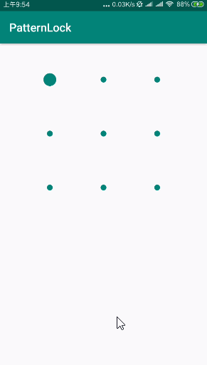

# 快速实现手势解锁功能。


### 添加 `PatternLock` 到项目

- 第一步： 添加 `JitPack` 到项目的根 `build.gradle` 中


```gradle
allprojects {
    repositories {
        ...
        maven { url 'https://jitpack.io' }
    }
}
```

- 第二步：添加库依赖


```gradle
dependencies {
    implementation 'com.github.huangziye:PatternLock:${latest_version}'
}
```


- 在 xml 中编写
 
 
 ```xml
 <com.hzy.lock.PatternLockView
     android:id="@+id/mPatternLockView"
     android:layout_width="280dp"
     android:layout_height="280dp"
     android:layout_gravity="center_horizontal"
     android:layout_marginTop="16dp"
     app:aspectRatio="square"
     app:aspectRatioEnabled="true"
     app:dotAnimationDuration="150"
     app:dotCount="3"
     app:dotNormalSize="10dp"
     app:dotSelectedSize="24dp"
     app:normalStateColor="@color/colorPrimary"
     app:correctStateColor="@color/colorPrimary"
     app:wrongStateColor="@color/pomegranate"
     app:pathEndAnimationDuration="100"
     app:pathWidth="3dp"/>
 ```


- 用 kotlin 代码实现

```kotlin
private fun initPatternLockView() {
    //设置横纵坐标点的个数
    mPatternLockView.setDotCount(3)
    //设置未选中点的大小
    mPatternLockView.setDotNormalSize(
        ResourceUtil.getDimensionInPx(
            this,
            R.dimen.pattern_lock_dot_size
        ) as Int
    )
    //设置选中时点的大小
    mPatternLockView.setDotSelectedSize(
        ResourceUtil.getDimensionInPx(
            this,
            R.dimen.pattern_lock_dot_selected_size
        ) as Int
    )
    //设置路径线的宽度
    mPatternLockView.setPathWidth(
        ResourceUtil.getDimensionInPx(
            this,
            R.dimen.pattern_lock_path_width
        ) as Int
    )
    //设置宽高比是否启用
    mPatternLockView.setAspectRatioEnabled(true)
    //设置宽高比
    mPatternLockView.setAspectRatio(PatternLockView.AspectRatio.ASPECT_RATIO_HEIGHT_BIAS)
    //设置View的模式
    mPatternLockView.setViewMode(PatternLockView.PatternViewMode.CORRECT)
    //设置点动画持续时间
    mPatternLockView.setDotAnimationDuration(150)

    // 设置Pat结束动画持续时间
    mPatternLockView.setPathEndAnimationDuration(100)
    //设置正确的状态颜色
    mPatternLockView.setCorrectStateColor(ResourceUtil.getColor(this, R.color.colorPrimary))
    //是否设置为隐身模式
    mPatternLockView.setInStealthMode(false)
    //设置是否启用触觉反馈
    mPatternLockView.setTactileFeedbackEnabled(true)
    //设置输入是否启用
    mPatternLockView.setInputEnabled(true)
    mPatternLockView.addPatternLockListener(mPatternLockViewListener)
}
```


### 效果预览



<br />

### 关于我


- [简书](https://user-gold-cdn.xitu.io/2018/7/26/164d5709442f7342)

- [掘金](https://juejin.im/user/5ad93382518825671547306b)

- [Github](https://github.com/huangziye)

<br />

### License

```
Copyright 2018, huangziye

   Licensed under the Apache License, Version 2.0 (the "License");
   you may not use this file except in compliance with the License.
   You may obtain a copy of the License at

       http://www.apache.org/licenses/LICENSE-2.0

   Unless required by applicable law or agreed to in writing, software
   distributed under the License is distributed on an "AS IS" BASIS,
   WITHOUT WARRANTIES OR CONDITIONS OF ANY KIND, either express or implied.
   See the License for the specific language governing permissions and
   limitations under the License.
```


